# Learnova — Database Architecture Overview

> All data is handled within **Django's ORM** (MySQL via Docker). There are no external databases.
> Every table below corresponds to a Django model. Primary keys are always auto-increment integers unless stated otherwise.

---

## Apps & Their Responsibility

| App | Purpose |
|---|---|
| `accounts` | Users, authentication, roles |
| `assets` | File storage records (S3 / local) |
| `taxonomy` | Categories and tags |
| `content` | All course content (courses, modules, lessons, videos, quizzes, resources) |
| `quizzes` | Quiz questions, options, attempts, answers |
| `enrollment` | Course memberships and learner progress |
| `gamification` | Badges and point ledger |
| `reviews` | Course star ratings and text reviews |

---

## Entity-Relationship Overview

```mermaid
erDiagram
    %% ===================== ACCOUNTS =====================
    User {
        bigint id PK
        string email UK
        string password
        string first_name
        string last_name
        string role "admin | instructor | learner"
        text bio
        string avatar
        int points
        datetime last_login_at
        datetime last_login
        bool is_superuser
        bool is_staff
        bool is_active
        datetime date_joined
    }

    %% ===================== ASSETS =====================
    Asset {
        bigint id PK
        smallint storage_provider "S3=1 | CloudFront=2 | Local=3"
        string bucket_name
        string object_key UK
        string file_name
        string mime_type
        bigint file_size_bytes
        string checksum_sha256
        int width
        int height
        int duration_seconds
        string etag
        bool is_public
        bigint uploaded_by_id FK
        datetime created_at
    }

    %% ===================== TAXONOMY =====================
    Category {
        bigint id PK
        string name
        string slug UK
        bigint parent_id FK
        datetime created_at
    }

    Tag {
        bigint id PK
        string name
        string slug UK
        datetime created_at
    }

    EntityCategory {
        bigint id PK
        bigint entity_id FK "UK(entity,category)"
        bigint category_id FK
        datetime created_at
    }

    EntityTag {
        bigint id PK
        bigint entity_id FK "UK(entity,tag)"
        bigint tag_id FK
        datetime created_at
    }

    %% ===================== CONTENT =====================
    ContentEntity {
        bigint id PK
        smallint entity_type "Course=1 | Module=2 | Lesson=3 | Video=4 | Quiz=5 | Article=6 | Resource=7"
        string title
        string slug UK
        string short_description
        text description
        bigint owner_id FK
        smallint status_code "Draft=1 | Published=2 | Archived=3 | Hidden=4"
        bigint thumbnail_asset_id FK
        int estimated_duration_seconds
        bool allow_standalone_enrollment
        bool is_reusable
        datetime published_at
        datetime archived_at
        datetime created_at
        datetime updated_at
        datetime deleted_at "soft delete"
    }

    ContentStructure {
        bigint id PK
        bigint parent_entity_id FK "UK(parent,child)"
        bigint child_entity_id FK
        int sort_order
        bool is_required
        bool is_preview
        smallint unlock_rule_code "Immediate=1 | AfterPrev=2 | AfterPrereq=3 | Scheduled=4 | Manual=5"
        json unlock_rule_config
        datetime created_at
    }

    CourseSettings {
        bigint entity_id PK "FK→ContentEntity (1:1)"
        smallint visibility_code "Everyone=1 | SignedIn=2"
        smallint access_rule_code "Open=1 | Invitation=2 | Payment=3"
        decimal price "max_digits=10, dp=2"
        string website
        bigint responsible_id FK
        smallint level_code "Beginner=1 | Intermediate=2 | Advanced=3"
    }

    VideoContent {
        bigint entity_id PK "FK→ContentEntity (1:1)"
        bigint video_asset_id FK
        bigint poster_asset_id FK
        bigint captions_asset_id FK
        string video_url
        smallint streaming_provider "DirectS3=1 | CloudFront=2 | HLS=3"
        int duration_seconds
        text transcript_text
        bool allow_download
        bool autoplay_enabled
    }

    ArticleContent {
        bigint entity_id PK "FK→ContentEntity (1:1)"
        text body_markdown
        int reading_time_seconds
    }

    ResourceContent {
        bigint entity_id PK "FK→ContentEntity (1:1)"
        bigint asset_id FK
        string resource_url
        smallint resource_kind "PDF=1 | Image=2 | Worksheet=3 | Attachment=4 | ExternalLink=5"
        bool allow_download
    }

    LessonContent {
        bigint entity_id PK "FK→ContentEntity (1:1)"
        smallint lesson_format "Text=1 | Mixed=2 | Guided=3 | Wrapper=4"
        text body
    }

    QuizContent {
        bigint entity_id PK "FK→ContentEntity (1:1)"
        text instructions
        int attempt_limit
        int pass_percentage
        bool shuffle_questions
        bool shuffle_options
        bool show_answers_after_submit
        bool show_score_immediately
        int time_limit_seconds
        bool allow_resume
        bool award_points
    }

    EntityStats {
        bigint entity_id PK "FK→ContentEntity (1:1)"
        int direct_child_count
        int required_child_count
        int total_duration_seconds
        int enrollment_count
        int completion_count
        decimal average_rating "max_digits=3, dp=2"
        int total_reviews
        int total_points_awarded
        int views_count
        datetime updated_at
    }

    CompletionRule {
        bigint id PK
        bigint entity_id FK
        smallint rule_type "AllRequired=1 | AnyN=2 | PassQuiz=3 | WatchPct=4 | Manual=5"
        json rule_config
        datetime created_at
    }

    EntityPrerequisite {
        bigint id PK
        bigint entity_id FK "UK(entity,required_entity)"
        bigint required_entity_id FK
        datetime created_at
    }

    ContentAttachment {
        bigint id PK
        bigint entity_id FK
        string title
        bigint asset_id FK
        string external_url
        int sort_order
        datetime created_at
    }

    %% ===================== QUIZZES =====================
    QuizQuestion {
        bigint id PK
        bigint quiz_entity_id FK
        smallint question_type "MCQ_Single=1 | MCQ_Multiple=2 | ShortText=3 | TrueFalse=4"
        text question_text
        text explanation_text
        int marks
        int sort_order
        bool is_active
        datetime created_at
        datetime updated_at
    }

    QuizOption {
        bigint id PK
        bigint question_id FK
        string option_text
        bool is_correct
        int sort_order
    }

    QuizAttempt {
        bigint id PK
        bigint quiz_entity_id FK
        bigint learner_id FK
        int attempt_no
        int score
        int max_score
        decimal percentage "max_digits=5, dp=2"
        bool is_passed
        int time_spent_seconds
        int points_earned
        datetime started_at
        datetime submitted_at
        datetime created_at
    }

    QuizAttemptAnswer {
        bigint id PK
        bigint attempt_id FK "UK(attempt,question)"
        bigint question_id FK
        bigint selected_option_id FK
        text text_answer
        bool is_correct
        int marks_awarded
        datetime answered_at
    }

    QuizRewardRule {
        bigint id PK
        bigint quiz_entity_id FK
        int attempt_from
        int attempt_to
        int points_awarded
        datetime created_at
    }

    %% ===================== ENROLLMENT =====================
    CourseMembership {
        bigint id PK
        bigint course_entity_id FK "UK(course_entity,user) partial"
        bigint user_id FK
        string invited_email
        bigint invited_by_id FK
        string invite_token UK
        smallint membership_status "Invited=1 | Active=2 | Completed=3 | Revoked=4 | Expired=5"
        smallint access_mode "Open=1 | Invitation=2 | AdminAssigned=3 | Imported=4"
        datetime invited_at
        datetime enrolled_at
        datetime started_at
        datetime completed_at
        datetime revoked_at
        datetime last_accessed_at
        smallint progress_percent
        int time_spent_seconds
    }

    EntityProgress {
        bigint id PK
        bigint learner_id FK "UK(learner,entity)"
        bigint entity_id FK
        smallint progress_status "NotStarted=1 | InProgress=2 | Completed=3 | Failed=4 | Locked=5"
        smallint progress_percent
        int last_position_seconds
        datetime started_at
        datetime completed_at
        datetime last_accessed_at
        datetime updated_at
    }

    %% ===================== GAMIFICATION =====================
    Badge {
        bigint id PK
        string name
        string slug UK
        text description
        int min_points
        bigint icon_asset_id FK
        int sort_order
        bool is_active
        datetime created_at
    }

    UserBadge {
        bigint id PK
        bigint user_id FK "UK(user,badge)"
        bigint badge_id FK
        datetime awarded_at
    }

    UserPointLedger {
        bigint id PK
        bigint user_id FK
        smallint source_type "Quiz=1 | CourseCompletion=2 | LessonCompletion=3 | AdminBonus=4 | BadgeBonus=5"
        bigint source_entity_id FK
        bigint source_attempt_id FK
        int points
        string reason
        datetime created_at
    }

    %% ===================== REVIEWS =====================
    CourseReview {
        bigint id PK
        bigint course_entity_id FK "UK(course_entity,user)"
        bigint user_id FK
        smallint rating
        text review_text
        bool is_published
        datetime created_at
        datetime updated_at
    }

    %% ===================== RELATIONSHIPS =====================

    %% User relationships
    User ||--o{ ContentEntity : "owns"
    User ||--o{ Asset : "uploads"
    User ||--o{ CourseMembership : "enrolled_in"
    User ||--o{ CourseMembership : "invited_by"
    User ||--o{ EntityProgress : "tracks"
    User ||--o{ QuizAttempt : "attempts"
    User ||--o{ UserBadge : "earns"
    User ||--o{ UserPointLedger : "earns_points"
    User ||--o{ CourseReview : "writes"
    User ||--o{ CourseSettings : "responsible_for"

    %% ContentEntity core relationships
    ContentEntity ||--o{ ContentStructure : "parent_of"
    ContentEntity ||--o{ ContentStructure : "child_of"
    ContentEntity ||--o| CourseSettings : "has_settings"
    ContentEntity ||--o| VideoContent : "has_video"
    ContentEntity ||--o| ArticleContent : "has_article"
    ContentEntity ||--o| ResourceContent : "has_resource"
    ContentEntity ||--o| LessonContent : "has_lesson"
    ContentEntity ||--o| QuizContent : "has_quiz"
    ContentEntity ||--o| EntityStats : "has_stats"

    %% ContentEntity → taxonomy
    ContentEntity ||--o{ EntityCategory : "categorized"
    ContentEntity ||--o{ EntityTag : "tagged"

    %% ContentEntity → other
    ContentEntity ||--o{ ContentAttachment : "has_attachments"
    ContentEntity ||--o{ CompletionRule : "has_rules"
    ContentEntity ||--o{ EntityPrerequisite : "requires"
    ContentEntity ||--o{ EntityPrerequisite : "required_by"
    ContentEntity ||--o{ QuizQuestion : "has_questions"
    ContentEntity ||--o{ QuizAttempt : "attempted_on"
    ContentEntity ||--o{ QuizRewardRule : "rewards"
    ContentEntity ||--o{ CourseMembership : "has_members"
    ContentEntity ||--o{ EntityProgress : "progress_tracked"
    ContentEntity ||--o{ CourseReview : "reviewed"
    ContentEntity ||--o{ UserPointLedger : "source_entity"

    %% Asset relationships
    Asset ||--o{ ContentEntity : "thumbnail_for"
    Asset ||--o{ VideoContent : "video_asset"
    Asset ||--o{ VideoContent : "poster_asset"
    Asset ||--o{ VideoContent : "captions_asset"
    Asset ||--o{ ResourceContent : "resource_asset"
    Asset ||--o{ ContentAttachment : "attachment_asset"
    Asset ||--o{ Badge : "icon_asset"

    %% Taxonomy
    Category ||--o{ Category : "parent_of"
    Category ||--o{ EntityCategory : "categorizes"
    Tag ||--o{ EntityTag : "tags"

    %% Quiz chain
    QuizQuestion ||--o{ QuizOption : "has_options"
    QuizQuestion ||--o{ QuizAttemptAnswer : "answered_in"
    QuizAttempt ||--o{ QuizAttemptAnswer : "has_answers"
    QuizOption ||--o{ QuizAttemptAnswer : "selected_in"
    QuizAttempt ||--o{ UserPointLedger : "source_attempt"

    %% Gamification
    Badge ||--o{ UserBadge : "awarded_to"
```



---

## Content Hierarchy (Entity Tree)

```
Course  (entity_type=1)
  └── Module  (entity_type=2)          [via ContentStructure]
        └── Lesson  (entity_type=3)    [via ContentStructure]
              ├── Video  (entity_type=4)
              ├── Quiz   (entity_type=5)
              ├── Article (entity_type=6)
              └── Resource (entity_type=7)
```

All relationships between content nodes are stored in `content_contentstructure`.  
Each node can have multiple children; the order is controlled by `sort_order`.

---

## Key Design Decisions

| Decision | Reason |
|---|---|
| Single `ContentEntity` table for all content types | Uniform slug, ownership, status, and hierarchy handling |
| Per-type detail tables (`VideoContent`, `QuizContent`, etc.) | Normalised — only relevant columns stored per type |
| `ContentStructure` junction table | Allows re-use of content nodes across multiple parents (`is_reusable`) |
| `EntityStats` cached table | Avoids expensive COUNT/AVG queries at read time |
| `CourseMembership` + `EntityProgress` split | Membership tracks enrollment state; progress tracks completion per entity node |
| `UserPointLedger` as append-only ledger | Full audit trail of all point events |
| `Badge` auto-check on every point award | Ensures badges are never missed without a background job |
